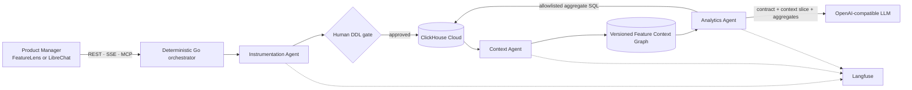

# FeatureLens

FeatureLens is an agentic product-analytics system for the **Atlys Click-a-thon 2026** track. It evolves ClickHouse instrumentation and business context together, then produces evidence-backed product decisions whose schema, SQL, context version, aggregate evidence, and Langfuse trace remain inspectable.

> Ship a feature once. Instrument it safely. Teach the organization what it means. Trust every answer that follows.

## Team

| Field | Value |
|---|---|
| Team | VIEW26 |
| Track | Atlys — Agents That Instrument, Analyze, and Explain |
| Project | FeatureLens — The Agentic Context Layer for Trustworthy Product Analytics |
| Team members | **Add names and handles before the submission PR** |

## Hosted demo

**[https://clickathon-2026.view26.com](https://clickathon-2026.view26.com)**

The staging deployment must be live and publicly reachable before the submission PR is opened.

## Demo video

**Add the final 2–3 minute Loom, YouTube, or public Drive URL before submission.**

Suggested recording path: release inbox → schema approval → context v5→v6 → surprise insight → Trace Explorer → one portfolio question.

## What it does

FeatureLens closes the gap between a feature specification and a trustworthy product decision:

1. The **Instrumentation Agent** profiles arbitrary NDJSON, proposes typed ClickHouse DDL, validates it, and stops at a human approval gate.
2. The **Context Agent** publishes an immutable Feature Context Graph that links the new schema to entities, events, dimensions, metrics, funnels, business questions, playbooks, guardrails, and known conflicts.
3. The **Analytics Agent** compiles questions into allowlisted ClickHouse aggregate queries, produces a deterministic evidence-backed answer, and optionally lets an LLM improve only the narrative.
4. **Langfuse** records each handoff, ClickHouse query, generation, cost, model, evaluation, and Product Manager feedback signal.
5. **LibreChat** can consume the same governed capabilities through a Streamable HTTP MCP interface.

The LLM never receives raw event rows, cannot select arbitrary tables, cannot change the SQL or evidence, and cannot raise confidence above the deterministic evidence ceiling. Unsupported questions fail closed without executing SQL.

## Submission evidence snapshot

| Evidence | Verified result |
|---|---:|
| Canonical Atlys source tables inspected | 8 |
| Published feature releases | 6 |
| Retained feature events | 34,982 |
| Latest context | v6 |
| Context graph | 147 nodes · 396 edges · 4 explicit conflicts |
| Context-evolution evaluations | 54/54 passed |
| Standard PM probes | 4/4 answered with synced Langfuse traces |
| Surprise feature | Promo / Coupon at Checkout |
| Surprise events profiled | 5,363 across 6 event types |
| Surprise insight | Coupon-marked cohort converts 6.44 percentage points below the null-marker baseline |

The autonomous eight-source-table report identifies the `application_started` → `document_uploaded` handoff as the largest observed baseline stage-volume loss (86.8%). It explicitly treats this as a diagnostic signal, not a causal or cohort-conversion claim, until observation windows and identifier continuity are aligned.

## Architecture



The full 1–2 page submission architecture, agent handoffs, storage rationale, and provider choices are in [submission/ARCHITECTURE.md](./submission/ARCHITECTURE.md).

## How it was built

- **Frontend:** React 19, TypeScript, vinext, Recharts.
- **Control plane:** Go 1.25 with three standalone agent modules and deterministic orchestration.
- **Evidence and durable state:** ClickHouse Cloud for the eight Atlys source tables, versioned feature tables, context versions, schema registry, run history, diffs, conflicts, and evaluations.
- **Observability:** Langfuse Cloud via OpenTelemetry, plus trace scores and human feedback in Trace Explorer.
- **LLM:** OpenAI-compatible structured generation; the submitted configuration uses `openai/gpt-4.1-mini` through OpenRouter for compact PM synthesis. Deterministic fallback remains available.
- **Conversational OSS surface:** LibreChat through seven governed MCP tools.

## How to run

See **[RUN.md](./RUN.md)** for environment variables, ClickHouse connectivity, the one-command end-to-end pipeline, local UI, unseen-feature flow, verification, and staging deployment.

Quick verification after dependencies and `.env` are ready:

```bash
./scripts/run-submission.sh
```

## Submission artifacts

| Artifact | Path |
|---|---|
| Reproducible runbook | [RUN.md](./RUN.md) |
| Architecture | [submission/ARCHITECTURE.md](./submission/ARCHITECTURE.md) |
| Eight-table autonomous report | [submission/evidence/baseline-source-report.json](./submission/evidence/baseline-source-report.json) |
| Five known-feature DDLs | [submission/evidence/known-feature-schemas.sql](./submission/evidence/known-feature-schemas.sql) |
| Standard PM probes | [submission/evidence/standard-probes.md](./submission/evidence/standard-probes.md) |
| Langfuse trace index | [submission/evidence/traces.md](./submission/evidence/traces.md) |
| Surprise DDL | [submission/surprise/generated-schema.sql](./submission/surprise/generated-schema.sql) |
| Surprise insight | [submission/surprise/insight.md](./submission/surprise/insight.md) |
| Context before/after | [submission/surprise/context-changelog.md](./submission/surprise/context-changelog.md) |
| Pitch deck | [submission/pitch-deck.pdf](./submission/pitch-deck.pdf) |
| Editable pitch deck | [submission/pitch-deck.pptx](./submission/pitch-deck.pptx) |
| Readiness checklist | [submission/CHECKLIST.md](./submission/CHECKLIST.md) |

## Safety and secrets

No credential is committed. Copy `.env.example` to `.env`; all `.env*` files other than the example are ignored. Rotate any key that has been exposed in a screenshot or chat before the public submission.

## Repository and submission shape

The working repository is [view26/clickathon-2026](https://bitbucket.org/view26/clickathon-2026). For the hackathon submission, copy this repository into a single root-level `VIEW26/` folder in the official submissions fork and open one PR titled **`[Submission] VIEW26`**.
