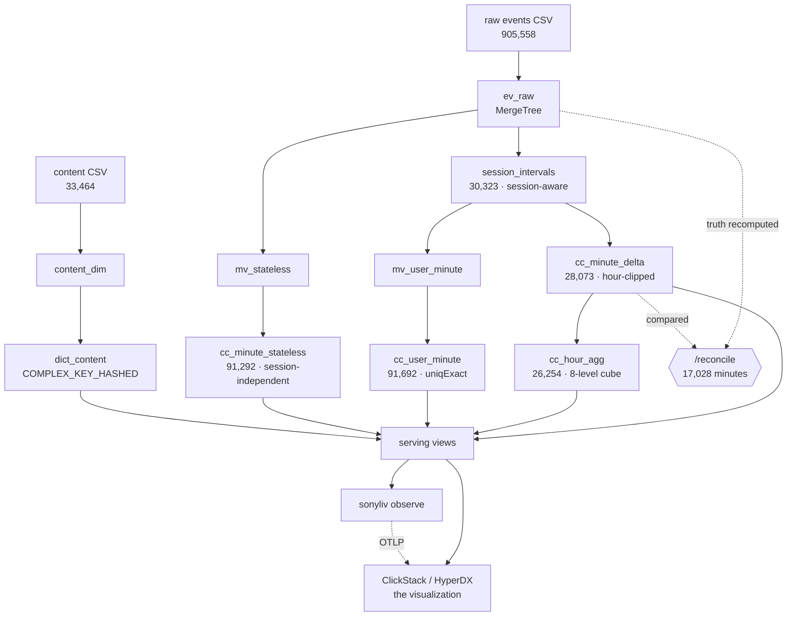

# CHECKPOINT 1 — requirements, system design, and what we show the mentor

> ⚠️ **This is a frozen, dated record (2026-08-01, commit `a38a755`) — its numbers are as-of that moment. For current status and current numbers, read [WALKTHROUGH.md](../WALKTHROUGH.md); do not mix this file's claims with post-checkpoint state.**

> **Summary:** Two halves. **Part A** is the requirements scope-out — what the organisers actually
> mandate (datastore, integration, deliverables, evaluation axes) and the full system design that
> answers it: services, layers, inputs, outputs, every table and view, with the arithmetic rules that
> make it correct. **Part B** is the mentor-checkpoint pack — the 5-minute live demo script, the
> progress narrative, the four questions worth their time (each carrying measured evidence), and the
> 47-minute speedrun that closes the biggest scoring gap before we walk in. Every number here was
> **queried live** against ClickHouse Cloud `sonyliv` on 2026-08-01, not copied from a doc — and where
> the repo docs disagree with the live service, that is flagged as **DOC DRIFT** and listed as work.

**Live state at time of writing** · ClickHouse Cloud 26.2.1.525 · db `sonyliv` · commit `a38a755`

---

# PART A — REQUIREMENTS AND SYSTEM DESIGN

## A1 · What is actually required

Three sources define the contract, all in [`docs/upstream/`](../docs/upstream/) — never edited, they
*are* the spec.

### A1.1 Hard platform requirements (from `PROBLEM_STATEMENT.md` → *Requirements*)

| # | Requirement | Exact wording | Our state |
|---|---|---|---|
| R1 | **ClickHouse is the primary datastore and analytical engine** | "ingestion, modeling, and all concurrency computation live in ClickHouse" | ✅ every derivation is SQL in `sql/`; the Go binary orchestrates and observes, it computes nothing |
| R2 | **Meaningfully integrate ≥1 of ClickStack / Langfuse / LibreChat** | "Superficial inclusion won't count" | ✅ **ClickStack, in both directions** — it charts our serving layer *and* consumes our OTLP pipeline telemetry |
| R3 | **No AI required for the core** | "the winning ingredient is design, not model calls" | ✅ zero model calls in the pipeline |
| R4 | **Your own ClickHouse Cloud service** | "provisioned with your event credits. There is no shared instance" | ✅ `sonyliv` on Cloud, provisioned H0 |
| R5 | **Unseen-day answers must come from the pipeline** | "evidenced by query logs or traces. Hand-computed answers score nothing" | ✅ `tools/unseen-run.sh` rehearsed end-to-end, ~2.5 min for a 1 GB day |
| R6 | **Minimal visualization is enough** | polished frontends explicitly **out of scope** | ✅ HyperDX over our own views — no custom UI code |

### A1.2 Pipeline deliverables (from `README_START_HERE.md` → *Solution blueprint*)

The organiser specifies a four-step streaming pipeline. This is the checklist judges will read:

| Step | Requirement | State |
|---|---|---|
| 1 | Ingest raw playback events **with event-time timestamps** | ✅ `ev_raw`, partitioned by event-time day |
| 2 | **Enrich** events with content metadata | ✅ `dict_content` (`COMPLEX_KEY_HASHED`) + 3 content views |
| 3 | Apply **foreground-only filtering** and **deduplicate** late/repeated events | ✅ filtering; dedup **proven unnecessary** (4,210 dupes are inert — 0 of 3,725 minutes differ) |
| 4 | **Publish continuously updated aggregates** | ⚠️ **THE GAP.** We batch-rebuild via `make model`. Only `mv_stateless` and `mv_user_minute` are true MVs |

And two model families that must **both** exist and be **compared**:

| Family | Definition | Our implementation |
|---|---|---|
| **Session-aware** | "active viewers within a defined session" | `session_intervals` → `cc_minute_delta` → `v_concurrency_minute*` |
| **Session-independent** | "active foreground viewers directly from event state" | `mv_stateless` → `cc_minute_stateless` → `v_concurrency_minute_stateless` |
| **The comparison** | "validate accuracy and operational trade-offs" | ✅ structural, not bolted on — §2 of `evidence/reconcile.txt` prints both plus naive on the same minutes |

Three core aggregations, all required:

| Aggregation | Key consideration named by the organiser | State |
|---|---|---|
| Foreground concurrency | event time, state transitions, late arrivals | ✅ |
| Content-level concurrency | metadata enrichment + join consistency | ✅ `v_concurrency_minute_{title,video_type,category}` |
| Time-window trend | window duration, watermarking, refresh latency | ✅ `v_cc_rolling_*` / `v_cc_tumbling_*` / `v_cc_window_range` |

### A1.3 The five questions the system must answer *with working code*

Straight from the statement — a mentor may ask any of these verbatim:

1. **How do you define an active interval** when the heartbeat is missing, the player is paused, or the app is backgrounded?
2. **How should active ranges be represented** — interval arrays, normalized intervals, minute deltas, hybrid?
3. **How do you compute minute-wise peak and average** without scanning raw session history per query?
4. **How does the model stay filter-friendly** across platform / country / content / video type / time grain?
5. **How do you handle still-open sessions** whose active ranges keep growing?

Our answers are §A3–A6 below.

### A1.4 Evaluation axes (this is the scorecard)

| Axis | What judges look at | Our evidence |
|---|---|---|
| **Correctness** | judge raw-event spot-checks; "foreground-only means foreground-only" | the gate: **17,028 minutes**, 0 mismatched, truth recomputed from `ev_raw` alone |
| **Query performance** | "what your queries read, not just how fast they return" | headline curve **7 ms / 329 KiB / 28,073 rows**; every benchmark run tagged with `log_comment` |
| **Update handling** | "incrementally, or by recomputing?" | 3 arrival classes, 3 mechanisms (§A6) — but the **publication** is still batch (§A1.2 step 4) |
| **Design quality** | "a team that can defend its trade-offs beats a team with a lucky benchmark" | 11 ADRs, each with a measured number |
| **The unseen day** | "carries significant weight… no pipeline evidence, no credit" | `docs/RUNBOOK_UNSEEN.md` + rehearsed script |

### A1.5 Scale framing — the sentence that kills naive designs

> "The provided dataset is a scaled-down proxy for a **petabyte-class** production problem. Judges will
> ask how your design behaves at **100×**, so choices that only work at hackathon size (full rescans,
> per-minute explosion of all history) will be treated as what they are."

This is why `cc_minute_delta` exists at all, and why our own `v_concurrency_minute_intervals`
(the per-minute expansion) is documented **as not the serving path**.

### A1.6 Engineering requirements we impose on ourselves

From [`AGENT_WORKFLOW.md`](../AGENT_WORKFLOW.md) / [`CLAUDE.md`](../CLAUDE.md):

- **Go toolchain pinned via `direnv`**; `make ci` = `tidy vet lint test build`, same order as CI.
- **Every SQL convention in [`docs/CONVENTIONS.md`](../docs/CONVENTIONS.md)** — most importantly the
  `PARTITION BY toStartOfHour(minute)` on every running sum. Forgetting it yields *plausible wrong numbers*.
- **A change that outdates a doc updates the doc in the same commit.** First 7 lines of every doc are a greppable summary.
- **No credentials in git** — everything through `.env`.
- **No hand-computed answers.** Numbers come from `evidence/`, regenerated by scripts, committed.
- **`/reconcile` re-runs after every model change.** It exits non-zero, and has been negative-tested to prove it can.

---

## A2 · System diagram — services, layers, inputs, outputs

### A2.1 Service topology (the deployable units)

```
┌───────────────────────────────────────────────────────────────────────────────────────────┐
│                              INPUTS (the organiser's contract)                            │
│                                                                                           │
│   ch-hackathon-raw-data.csv         905,558 event rows  · sha256-pinned                    │
│   ch-hackathon-content-data.csv      33,464 title rows  · sha256-pinned                    │
│   <unseen day>.csv                  released final hours · same universe, unknown shape    │
└─────────────────────────────────────────┬─────────────────────────────────────────────────┘
                                          │  tools/fetch_data.sh   (pins hashes, syncs 3 spec docs)
                                          │  tools/load.sh         (refuses to double-load; --replace/--append)
                                          ▼
╔═══════════════════════════════════════════════════════════════════════════════════════════╗
║  SERVICE 1 · ClickHouse Cloud  `sonyliv`   ← R1: THE primary datastore + analytical engine ║
║              26.2.1.525                       ALL modeling and computation happens here    ║
║                                                                                           ║
║   ┌── L0 INGEST ────────────────────────────────────────────────────────────────────┐     ║
║   │  ev_raw          MergeTree     905,558     PARTITION toYYYYMMDD(event_timestamp) │     ║
║   │  content_dim     ReplacingMT    33,464     ORDER BY content_id                   │     ║
║   └──────────────────┬────────────────────────────────────────┬─────────────────────┘     ║
║                      │                                        │                           ║
║   ┌── L1 DERIVE ─────▼──────────────────┐   ┌── L1' STATELESS ▼──────────────────┐        ║
║   │ session_intervals  ReplacingMT      │   │ mv_stateless  (real MV, streaming) │        ║
║   │   (build_version)   30,323 rows     │   │        ↓                           │        ║
║   │ SESSION-AWARE · the accurate model  │   │ cc_minute_stateless  91,292        │        ║
║   │   gaps >150s  → backgrounding       │   │ SESSION-INDEPENDENT · the baseline │        ║
║   │   MINUS explicit pause/resume       │   │   heartbeat lease, uniqExactState  │        ║
║   │ built by sql/30_build_intervals.sql │   │   idempotent · replay-safe         │        ║
║   └──────────────────┬──────────────────┘   └────────────────┬───────────────────┘        ║
║                      │                                       │                            ║
║   ┌── L2 SERVE ──────▼───────────────────────────────────────┼──────────────────┐         ║
║   │ cc_minute_delta   AggregatingMT   28,073   HOUR-CLIPPED  │                  │         ║
║   │   ORDER BY (platform, country, content_id, minute, +4 dims)                  │         ║
║   │   delta/starts/ends : SimpleAggregateFunction(sum, Int64)  ← Int64 is load-  │         ║
║   │                                                             bearing (ADR0006)│         ║
║   │ cc_user_minute    AggregatingMT  91,692   uniqExactState(user_id)           │         ║
║   │   ← MV-fed. Users are NOT summable across dimensions; sessions are.          │         ║
║   └──────────────────┬───────────────────────────────────────────────────────────┘        ║
║                      │                                                                    ║
║   ┌── L3 ROLLUP ─────▼──────────────────────────────────────────────────────────┐         ║
║   │ cc_hour_agg   ReplacingMT(computed_at)   26,254   8-level dimension cube     │         ║
║   │   per (dims, hour): peak · peak_minute · integral                            │         ║
║   │   correct ONLY because deltas are hour-clipped (ADR 0003)                    │         ║
║   └──────────────────┬──────────────────────────────────────────────────────────┘         ║
║                      │                                                                    ║
║   ┌── L4 QUERY ──────▼──────────────────────────────────────────────────────────┐         ║
║   │ 30 views. A chart tool CANNOT read an AggregateFunction column — that is    │         ║
║   │ why this layer exists at all.                                                │         ║
║   │   dict_content (COMPLEX_KEY_HASHED)   ← plain HASHED cannot dictGet a        │         ║
║   │                                          NEGATIVE key, and content_dim has 1 │         ║
║   │   4 UDFs: norm_lang · norm_case · norm_version · lang_class  (ADR 0011)      │         ║
║   └──────────────────┬──────────────────────────────────────────────────────────┘         ║
║                      │                                                                    ║
║   system.query_log   ← the authoritative latency/bytes record; a HyperDX source reads it   ║
╚══════════════════════╪════════════════════════════════════════════════════════════════════╝
                       │
        ┌──────────────┴───────────────┬────────────────────────────────┐
        │ reads (SQL)                  │ reads (SQL)                    │ writes (OTLP/HTTP JSON)
        ▼                              ▼                                ▲
╔═══════════════════════════╗  ╔═══════════════════════════╗  ╔═════════╧═══════════════════╗
║ SERVICE 2 · ClickStack    ║  ║ SERVICE 3 · sonyliv CLI   ║  ║  R2: the integration is      ║
║   (HyperDX)               ║  ║   Go, cmd/sonyliv         ║  ║  BIDIRECTIONAL — delete      ║
║                           ║  ║                           ║  ║  ClickStack and the demo's   ║
║ (a) IS the visualization  ║  ║  verify   — env/schema    ║  ║  freshness panel has         ║
║     concurrency curve,    ║  ║  observe  — emits OTLP ───╫──╫─▶ nowhere to come from.      ║
║     filters, drilldown    ║  ║             · watermark   ║  ╚══════════════════════════════╝
║ (b) OBSERVES our pipeline ║  ║               lag          ║
║     otel_metrics_gauge    ║  ║             · build-stage  ║   internal/
║     otel_logs             ║  ║               timing       ║     chdb/          HTTP client
║     otel_traces           ║  ║             · reconcile    ║     config/        env + targets
║                           ║  ║               gate verdict ║     pipelinehealth/ watermark,
║ Option A: local container ║  ║                           ║     otelemit/       reconcile,
║ Option B: built into      ║  ║  Go computes NOTHING       ║                     buildstages
║   Cloud  ← we use this    ║  ║  about concurrency.        ║     ~250-line stdlib-only
╚═══════════════════════════╝  ╚═══════════════════════════╝     OTLP JSON client (no SDK)

╔═══════════════════════════════════════════════════════════════════════════════════════════╗
║  SERVICE 4 · the gate — tools/reconcile.sh + sql/90_reconcile.sql                          ║
║  Not a service that serves; a service that BLOCKS. Recomputes truth from ev_raw with        ║
║  window functions (NOT the model's arraySplit), compares every minute, exits 1 on any diff. ║
╚═══════════════════════════════════════════════════════════════════════════════════════════╝
                                          │
                                          ▼
┌───────────────────────────────────────────────────────────────────────────────────────────┐
│                                       OUTPUTS                                             │
│  · required results   (peak / average, minute·hour·day, with dimension filters)            │
│  · query latencies + bytes read, from system.query_log, tagged by log_comment              │
│  · evidence/*.txt — reconcile · truncation · dedup · load-guard · unseen-rehearsal         │
│  · the concurrency curve, rendered in HyperDX off the graded service                       │
│  · 11 ADRs + docs/ — the trade-off defence                                                 │
└───────────────────────────────────────────────────────────────────────────────────────────┘
```

### A2.2 The same thing as a flow (for the slide)



### A2.3 Every table and view, with its job

**Tables (physical)**

| Table | Engine | Rows (live) | Sort key | Why |
|---|---|---:|---|---|
| `ev_raw` | MergeTree | 905,558 | `(toStartOfHour(ts), platform, video_session_id, ts)` | ADR 0002 — **17.3× better** on the dashboard shape than session-id-first |
| `content_dim` | ReplacingMergeTree | 33,464 | `content_id` | dimension source |
| `session_intervals` | ReplacingMergeTree(**build_version**) | 30,323 | `(video_session_id, interval_start)` | one row per contiguous **active** range. Versioned on a monotonic counter — `ReplacingMergeTree(interval_end)` assumed re-derivation only extends, which is false (§A7 defect 1) |
| `cc_minute_delta` | AggregatingMergeTree | 28,073 | `(platform, country, content_id, minute, +4 dims)` | **the serving layer.** `+1` on open, `−1` on close, clipped to every hour the interval touches |
| `cc_minute_stateless` | AggregatingMergeTree | 91,292 | `(platform, country, content_id, minute)` | the session-independent comparison model |
| `cc_user_minute` | AggregatingMergeTree | 91,692 | `(platform, country, content_id, minute)` | user-level. **`uniqExactState`, never a sum** — summing a distinct count over-counted **9×** in testing |
| `cc_hour_agg` | ReplacingMergeTree(computed_at) | 26,254 | `(platform, country, content_id, hour)` | peak + integral per hour, 8-level cube. Day peak reads 24 rows/combo, not 1,440 |

**Materialized views (streaming, incremental)** — `mv_stateless`, `mv_user_minute`. These two are
genuinely continuous. Everything else is rebuilt by `tools/build-model.sh` — that is §A1.2 step 4, the gap.

**Views (serving)** — 30, grouped:

| Group | Views | Job |
|---|---|---|
| Headline curves | `v_concurrency_minute_delta_total` (session-aware), `v_concurrency_minute_total` (stateless), `v_concurrency_minute_intervals` (expansion, **not** the serving path) | the three definitions, side by side |
| Dimension-grained | `v_concurrency_minute`, `v_concurrency_hour`, `v_concurrency_day` (+ `_total` variants) | filter → sum deltas → running sum → **then** max |
| Content | `v_concurrency_minute_{title,video_type,category}`, `v_concurrency_{title,video_type,category}_now` | the enrichment deliverable |
| User | `v_user_concurrency_minute`, `v_user_concurrency_minute_total` | `uniqExactMerge`, never a sum |
| Windows | `v_cc_rolling_{total,dim}`, `v_cc_tumbling_{total,dim,hour}`, `v_cc_window_range` | **RANGE frames, not ROWS** — deltas store rows only where concurrency *changes*, so "5 rows back" ≠ "5 minutes back" |
| Normalisation | `v_cc_minute_delta_norm`, `v_concurrency_minute_audio_norm`, `v_dimension_drift` | ADR 0011 — normalise on read, not in storage |
| Health | `v_cc_watermark`, `v_content_orphan_check`, `v_content_title_collisions`, `v_dimension_drift_summary` | what `sonyliv observe` reads |

---

## A3 · Answer to Q1 — how we define an active interval

**This is the single most important slide.** It is the difference between a model that scores and one
that does not, and it was found by measurement, not assumption.

| Player state | Heartbeat rate | Detectable by gap threshold? |
|---|---:|---|
| Actively watching | **4.72 /min** | — |
| **Backgrounded** | **0.047 /min** — a **100× drop** | ✅ **yes** |
| **Paused** | **0.756 /min** — one event every ~79 s | ❌ **NO** — comfortably inside any sane threshold |

So a gap-only model **silently counts paused time as watching**, which the statement explicitly forbids.
The model is therefore a **hybrid**:

```
active interval  =  (contiguous run with no gap > HEARTBEAT_GAP_S)   ← catches backgrounding
                    MINUS explicit [pause, resume) windows            ← catches pause
                    PLUS  TAIL_GRACE_S at a run that ends in silence  ← credit for the last beat
```

Tunables, all in `sql/30_build_intervals.sql`, all derived from the data rather than from the doc:

| Tunable | Value | Derivation |
|---|---:|---|
| `HEARTBEAT_GAP_S` | 150 s | ~3× the measured p99 inter-arrival of 49 s |
| `TAIL_GRACE_S` | 60 s | one nominal cadence (see the caveat below) |
| `UNCLOSED_PAUSE_TO_RUN_END` | 1 (conservative) | 23% of pauses never resume — **mentor question Q2** |
| Watermark `W` | 2,400 s | 2.2% of sessions emit events up to **2,081 s** after `VideoSessionEnd` |

**The caveat that buys us credibility:** the organiser's `dataset_details.md` says the heartbeat is
"passed every 1 minute". It is not. `VideoHeartbeat` is **41 discrete telemetry sub-streams** under one
label. Mixed, they look aperiodic (p50 = 0 s). Separated, the three largest — `network-activity`
(177,485), `buffer-health` (167,460), `video-resize` (141,250) — each tick at **exactly 40.0 s**, p50
and p90 both. There *is* a pulse and it is **not the documented one**. Every tunable above is a function
of the cadence, so this is [doubts/01](../doubts/01-heartbeat-cadence.md) and it is a real fork.

## A4 · Answer to Q2 — how active ranges are represented

**Hybrid, and deliberately so.** Three representations, each where it wins:

1. **Normalized intervals** (`session_intervals`) — the derivation output. One row per contiguous active
   range. Cheap to re-derive per session, which is what the finalizer and the straggler path need.
2. **Hour-clipped minute deltas** (`cc_minute_delta`) — the serving layer. `O(intervals)` rows instead
   of `O(sessions × minutes)`. **Append-only** — nothing is ever updated in place.
3. **Pre-aggregated hour rollup** (`cc_hour_agg`) — peak + integral per hour, 8-level cube.

**Rejected: per-minute explosion of all history.** We built it (`v_concurrency_minute_intervals`) and
keep it *only* as an independent cross-check for the gate — it is documented in the SQL as not the
serving path. It is precisely the "only works at hackathon size" choice the statement names.

**Why hour-clipped** (ADR 0003) — the load-bearing trick:

```
interval 20:59:48 → 22:04:49  emits:
   +1 @ 20:59   +1 @ 21:00   +1 @ 22:00   −1 @ 22:05
   and NO close in hours 20 or 21
```

Each hour's running sum is **absolute and standalone**. That kills the carry-in scan from `t=0`, and it
makes peak pre-aggregable across time — which is the only reason `cc_hour_agg` is correct at all.

## A5 · Answer to Q3 and Q4 — peak/average without rescans, and filter-friendliness

**The three arithmetic rules.** Getting any of these wrong produces numbers that look plausible:

1. **Peak is not summable across dimensions.** platform+content and platform+country peak at *different
   minutes*; `max(a+b) ≤ max(a)+max(b)` and the gap is large. So we **never store a peak per dimension**.
   The order is always: filter → sum deltas per minute → running sum → **then** `max()`.
   *(Hour-clipping does make peak summable across **time** — a different axis. That is what `cc_hour_agg` exploits.)*
2. **Never sum a distinct count.** `uniqExactState`/`uniqExactMerge`. Session-level concurrency *is*
   summable across dimension buckets (one session has one platform, one content); **user-level is not**.
   Measured: a rollup that summed a distinct count over-counted **9×**.
3. **Average is time-weighted** — the integral of the curve over range length, **zero minutes included**.
   Cross-checked against `sum(interval durations clipped to range) / range_seconds`, which touches no
   delta layer at all.

**Filter-friendliness** — all **10** dimensions, and the row count is **hard-bounded at 36,930
regardless of how many dimensions exist**:

| Source | Dimensions |
|---|---|
| Carried raw in `cc_minute_delta` (ADR 0008) | `platform`, `country`, `content_id`, `app_version`, `audio_language`, `subtitle_language`, `player_version` |
| Via `dict_content` | `title`, `video_type`, `category` |

Serving keys are **dimension-first, then time** — dashboards filter then range-scan; measured **122×**
fewer rows read on a comparable A/B. `ev_raw` is the opposite (time-bucket-first, ADR 0002) because its
access pattern is different, and that tension is resolved deliberately, not accidentally.

`uniqExact` **everywhere, never `uniq`** — HLL's 1–2 % error is a silent correctness bug under exact
raw-event spot-checking.

## A6 · Answer to Q5 — still-open sessions and late arrivals

Three arrival classes, three mechanisms, **none of them a rebuild**:

| Arrival class | Absorbed by | Mechanism |
|---|---|---|
| Newer than watermark `W` | **hot tier** (`cc_minute_hot`, ADR 0005) | heartbeat leases + `uniqExact` — idempotent and monotone, so replays are no-ops and late beats are pure additions |
| In normal order | **finalizer** | re-derives **only sessions touched since the last run**, appends sealed deltas |
| Older than `W` (straggler) | **correction-by-diff** (ADR 0006) | recompute that one session with and without the straggler, **append the difference** — exactly as correct as a rebuild, of one session; cost scales with stragglers, not with history |

Open sessions need no special path: they keep renewing leases in the hot tier and stay provisional in
the sealed tier until `W` passes them. **`W` is the metric instrumented in ClickStack** — watermark lag
is the observable expression of the whole design.

⚠️ **Honest status:** the hot tier (`[H5]`) and the live straggler demo (`[H8]`) are **designed, ADR'd,
and not yet built**. The truncation test that proves absorption *does* run — it cuts the stream at the
peak (52.6 % of sessions open), absorbs 447,081 late events, and now matches a from-scratch build row for
row on all 1,578 minutes, after the `build_version` fix. That is the proof; the live demo is not wired.

## A7 · The two defects our own tests caught (tell this story — it lands)

Both were found by test, not by review, and both are fixed and re-gated.

1. **Incremental absorption did not converge** — overcounted the peak minute by **37** (2,924 vs 2,887).
   `session_intervals` was `ReplacingMergeTree(interval_end)`, which assumes re-derivation only ever
   *extends* an interval. It doesn't: a provisional interval's 60 s tail grace can **overshoot** the true
   end, so the stale row wins forever — 316 intervals affected, 315 stuck at `is_open=1`. Now versioned on
   a monotonic `build_version`.
2. **`cc_minute_delta.starts/ends` were `UInt64`** and wrapped when ADR 0006 negated a corrective row:
   ClickHouse silently produced `2^64−n`, so `max()` returned `1.8e19` and `starts` inflated 22 %. Now `Int64`.

## A8 · Measured and *rejected* — the trade-offs we can defend both ways

Judges reward defended trade-offs. These are the ones we tested and said no to:

| Candidate | Verdict | Number |
|---|---|---|
| `PROJECTION` on `ev_raw` by `video_session_id` | **not shipped** | 27.7× on single-session lookups — but the real straggler path is `IN (subquery)`, which full-scans anyway → **1.00× for +94 % storage** |
| `argMax(col, version)` instead of `FINAL` | **rejected** | **3–4× slower, 5.7× more bytes.** One active part, zero duplicate keys → `FINAL` has nothing to collapse and costs nothing |
| App-side buffer + flush batching | **rejected** | `async_insert=1` is already on by default; we would reimplement the server and move durability into a process that can die holding data |
| Normalising dimensions inside the derivation | **rejected** | measured **worse** — 202 intervals degraded onto a sentinel. Normalise on read (ADR 0011) |
| `uniq` (HLL) instead of `uniqExact` | **rejected** | 1–2 % error under exact judge spot-checks is a silent correctness bug |
| Dedup of the 4,210 duplicate event rows | **proven unnecessary** | raw vs deduped derivation → identical intervals, **0 of 3,725 minutes differ** |

---

# PART B — MENTOR CHECKPOINT 1

## B1 · The 60-second opener

> "We're on SonyLIV foreground-only concurrency. It's built end to end on ClickHouse Cloud and the
> correctness gate is green on **every minute in the data — 17,028 of them, idle minutes included** —
> against truth recomputed from `ev_raw` alone.
>
> The headline: naive session-span overlap says **3,708** concurrent at the peak. Foreground-only says
> **2,917**. That's a **21.3 % over-count eliminated** — and across the whole file, **34 % of apparent
> watch time is backgrounded or paused**.
>
> The thing we'd most like your time on isn't the engineering — it's four **definition** questions the
> data cannot answer. The largest is worth **9.7 %** of our headline number, and our gate structurally
> cannot catch it, because it recomputes truth using the same rule and agrees with itself."

## B2 · What we can show — live, in 5 minutes

Everything below runs against the graded Cloud service. **Nothing is a screenshot.**

| # | Beat | Command | What they see | Time |
|---|---|---|---|---|
| 1 | **The curve** | HyperDX → source *Concurrency total (minute)*, range **2026-07-14 → 07-26** | the real concurrency curve off `v_concurrency_minute_delta_total`. Rises to 2,917 at 07-26 10:56 | 45 s |
| 2 | **The over-count** | `evidence/reconcile.txt` §2 | same minutes, three definitions side by side: session-aware **2,917** · stateless **2,894** · naive **3,708** (**+21.3 %**) | 45 s |
| 3 | **The gate** | `make reconcile` | `minutes_compared=17028 · mismatched=0 · max_abs_diff=0 · PASS` — truth from `ev_raw` with window functions, not the model's own arraySplit | 60 s |
| 4 | **The gate can fail** | narrate | inject one bad delta row → exit 1. Fabricate 500 viewers at an **idle** minute → 25 mismatches. Rebuild → exit 0 | 30 s |
| 5 | **Cost, not just speed** | `system.query_log`, tagged | headline curve **7 ms / 329 KiB / 28,073 rows**. The delta layer reads **8.5× less I/O** than expanding intervals | 45 s |
| 6 | **The two signals** | the A3 table | 4.72 vs **0.047** vs **0.756** beats/min. "A gap-only model counts paused time as watching. That's why pause is excluded *explicitly*." | 45 s |
| 7 | **ClickStack, both ways** | `sonyliv observe -target cloud`, then the freshness tile | it charts our data **and** consumes our OTLP. Delete ClickStack and the freshness panel has nowhere to come from | 45 s |

**Live numbers, re-verified today** — quote these, not the ones in `WALKTHROUGH.md` (see B6):

```
peak, session-aware (serving path)   2,917  @ 2026-07-26 10:56
peak, session-independent            2,894  @ same minute
peak, naive session-span             3,708      → 21.3% over-count
total foreground watch time        1,978.1 h
gate                               17,028 minutes · 0 mismatched · PASS
serving cost (headline curve)        7 ms · 329 KiB · 28,073 rows
```

## B3 · What we tell them about progress

**Done and gated:** ingest · session-aware model · session-independent model · the comparison · minute
delta serving layer · hour rollup cube · user-level concurrency · content enrichment · rolling/tumbling
windows · all 10 filter dimensions · ClickStack in both directions · unseen-day dry run · 11 ADRs.

**Designed, ADR'd, not built:** the hot tier (`[H5]`) and the live straggler demo (`[H8]`). Absorption
*is* proven by the truncation test; the live path is not wired.

**The one architectural gap, stated plainly** — say this before they find it:

> "Our aggregates are **batch-rebuilt** by `make model`, not continuously updated. Only two of our
> views are real MVs. The organiser's step 4 says *publish continuously updated aggregates*, so this is
> our biggest scoring gap and we know it. We've validated the native fix on this exact service —
> **refreshable materialized views** populated a target in **8 seconds, 1,579 rows**, with no external
> scheduler. We're wiring it now, and the refresh interval becomes a stated freshness SLA with
> `system.view_refreshes` making the lag observable."

Owning this is worth more than hiding it. Interval derivation is a cross-block, per-session,
time-ordered computation — a streaming MV genuinely cannot express it (ADR 0004), and that is the right
answer to "why isn't this just an MV?"

## B4 · The four questions worth their time

Each has a dossier in [`doubts/`](../doubts/) carrying measured evidence, exact wording, and a decision
table per possible answer. **Ask from the dossier.** Ranked by measured impact:

| Rank | Question | Worth | Our assumption |
|---|---|---|---|
| **1** | **`resume` semantics** — [doubts/02](../doubts/02-resume-semantics.md) · Q3. 31,780 resumes vs 27,340 pauses; **9,958 `resume→resume` pairs**; 900 sessions whose first pause/resume event is a *resume*. A clean toggle cannot produce that. Does a pause close at the **first** resume, or at one that actually corresponds to it? | **189.2 h · 9.7 %** of counted watch time | Rule A — first resume closes; unpaired resumes are noise |
| **2** | **Unclosed-pause rule** — Q2. **23 % of pauses never resume.** Stay paused to end of run, or end at next event? | 99.3 h · 5.09 % on hours · **+131 · +4.5 % on the graded peak** | conservative (stays paused) |
| **3** | **Heartbeat cadence** — [doubts/01](../doubts/01-heartbeat-cadence.md) · supersedes Q17. Your doc says 60 s; the shipped data ticks at **40.0 s**. Which will judges use? | ≤ 170.9 h · 8.8 % (upper bound) | the shipped data is authoritative |
| **4** | **Is Hindi one language or four?** — [doubts/04](../doubts/04-dimension-normalisation.md) · Q18. `hin` / `HIN` / `hin-hindi` / `hin-Hindi`. | **23.3 %** on any per-language answer (peak 1,768 → 2,180) | store raw, normalise on read |

**The line that makes all four land:**

> "None of these is measurable from the data — judge interpretation is unspecified, so a wrong guess is silently
> wrong on every benchmark answer and we would never see it. Our `/reconcile` gate **structurally cannot
> catch them**: it recomputes truth from `ev_raw` using the same rule, so it agrees with itself by
> construction. That's why we're asking rather than measuring."

**If there is still time**, in this order: Q4 session-vs-user (1 user, 2 sessions — 1 or 2?) · Q5 timezone
(UTC or IST — day-grain shifts 5.5 h, total silent failure) · Q6 exact match or tolerance · Q12 when does
the required query/result shapes land · Q14 unseen-day guarantees (**does it contain more than one `country`?** we
have exactly one, so a country-filter bug is invisible to us).

Full ranked list of 17: [`docs/MENTOR_QUESTIONS.md`](../docs/MENTOR_QUESTIONS.md).
**Record every answer inline in the same sitting and update the affected ADR in the same commit.**

## B5 · Visualization in place

- **The chart is ClickStack/HyperDX, not a custom frontend.** The statement puts polished frontends out
  of scope and separately requires an OSS integration — pointing HyperDX at our own serving layer
  satisfies both with one component and **zero UI code**. Every chart is backed by a real query against
  the graded service.
- **Sources**: concurrency total (minute), per-dimension, content-level, plus a
  **`system.query_log` source** charting p95 latency and bytes read of our own queries.
- **Freshness panel** (`tools/clickstack-observability.sh`) — watermark lag, build-stage timing, and
  the reconcile gate verdict, fed by `sonyliv observe` over OTLP.
- **⚠️ Demo trap:** the data ends **2026-07-26**. HyperDX's default 15-minute window renders **empty**.
  Set the range to **2026-07-14 → 2026-07-26** *before* screen-sharing.
- **Deep-dive diagrams:** [`docs/artifacts/2026-08-01-concurrency-model-deep-dive.html`](../docs/artifacts/2026-08-01-concurrency-model-deep-dive.html).

## B6 · The 47-minute speedrun before we walk in

Ordered by value per minute. **Items 1–3 are certain; item 4 is the stretch that closes the rubric gap.**

| # | Task | Min | Why now |
|---|---|---:|---|
| **1** | **Fix the stale headline numbers.** `WALKTHROUGH.md` and `docs/ARCHITECTURE.md` say peak **2,887**, hours **1,949.3**, delta rows **24,951**. Live is **2,917 / 1,978.1 h / 28,073** — the docs predate the ADR 0009 same-second-resume fix. | 10 | **Highest value.** A mentor who greps the repo must not find a number that contradicts what we just said out loud. Credibility is the whole checkpoint. |
| **2** | **Wire `sql/15_normalise.sql` into `tools/build-model.sh`** between stages 10 and 20. One line. | 2 | Built, measured, ADR'd (0011) — and **not in the build path**, so it does nothing today. Zero query cost, and it makes question B4-#4 demonstrable live |
| **3** | **Rehearse B2 once, end to end, on the real service.** Set the HyperDX time range first. | 10 | The demo has never been run start-to-finish under time pressure |
| **4** | **Refreshable MV over `v_concurrency_minute_delta_total`.** `CREATE MATERIALIZED VIEW … REFRESH EVERY 1 MINUTE TO …`. Validated on this service: self-populated **1,579 rows in 8 s**, no scheduler. | 25 | Converts "we batch-rebuild" into "we publish on a declared interval with observable lag" — the **single biggest rubric gap** (§A1.2 step 4), turned into a demo beat |

**Deliberately not in the hour:** the hot tier (`[H5]`) and the live straggler demo (`[H8]`) — both are
multi-hour and both already have a proof (the truncation test) we can point at instead.

**Found while writing this, not urgent, do not forget:** `sonyliv_trunc.cc_minute_delta` still has
`starts`/`ends` as **`UInt64`** — the pre-fix type. Production `sonyliv` is correctly `Int64`, so this is
not a scoring risk, but the truncation test runs in `sonyliv_trunc` and would silently wrap if a
corrective row were ever negated there. Re-apply `sql/10_intervals.sql` to that database before the next
truncation run.

## B7 · Answers to push back on, if challenged

| If they say | We say |
|---|---|
| *"Why not just a materialized view for the whole thing?"* | Interval derivation is a **cross-block, per-session, time-ordered** computation. A streaming MV cannot express it (ADR 0004). The stateless model **is** an MV — that is exactly why we built both and compare them |
| *"Your peak is lower than everyone else's."* | Correct, and that is the point. Naive gives 3,708. **34 % of apparent watch time is backgrounded or paused.** Foreground-only means foreground-only |
| *"How does this behave at 100×?"* | Delta layer is `O(intervals)`, not `O(sessions × minutes)`. Hour-clipping removes the scan-from-`t=0`. The row count is **hard-bounded at 36,930 regardless of dimension count**. What we would re-measure at 100× is the `FINAL` vs `argMax` call — it flips when parts are many and duplicates common |
| *"Show me the peak per platform."* | Careful — peak is **not summable across dimensions**. Filter → sum deltas → running sum → **then** max. `v_concurrency_minute` is grained by `content_id` too, so a platform-only answer must aggregate deltas first, not max the view |
| *"Prove the gate isn't self-confirming."* | It recomputes truth from `ev_raw` with **window functions**, not the model's `arraySplit` — a different algorithm on a different source. It derives its own target minutes so it works on any day, compares **idle** minutes (207 of 1,364 on the holdout), and has been negative-tested twice |
| *"Is the ClickStack integration meaningful?"* | It runs both directions. Delete it and the demo's freshness indicator has nowhere to come from — that is the rubric test we set ourselves |

---

# PART C — EVERYTHING ELSE: CODING STANDARDS, TESTS, LOGISTICS, RISKS, PLAN

## C1 · Coding requirements, in depth

The user-facing answer to "what coding requirements are there" splits into four rulebooks, all
enforced, none aspirational.

### C1.1 SQL conventions ([`docs/CONVENTIONS.md`](../docs/CONVENTIONS.md)) — the judgment calls

| Rule | Why it exists |
|---|---|
| **Every `CREATE TABLE` carries a comment saying why its `ORDER BY` is what it is** | "If you cannot write that sentence, you have not chosen a key — you have guessed one" |
| Sort keys: **filter dimensions first, time last** (serving tables) | dashboards filter then range-scan; measured 122× |
| Truncated time in the key (`toStartOfMinute`), raw timestamp only at the tail | a coarse bucket prunes because it repeats; `DateTime64(3)` does not |
| `PRIMARY KEY` may be shorter than `ORDER BY` | unique id stays in sort order for dedup, out of the sparse index |
| `LowCardinality(String)` for every dimension | — |
| **Never sum a distinct count across buckets** — `uniqState`/`uniqMerge`, `-MergeState` for a second hop | the 9× over-count |
| Plain columns in an `AggregatingMergeTree` must be `SimpleAggregateFunction` | hard error on 26.7 |
| **All tunables (`HEARTBEAT_GAP_S`, `TAIL_GRACE_S`, `W`) live at the top of `sql/10_intervals.sql` and nowhere else** | changing one must not require a grep |
| No `SELECT *` in anything that ships; benchmark runs labelled `SETTINGS log_comment='…'` | evidence must be findable in `query_log` |
| `dictGet` over joining a small dimension | 3.7× less memory, measured on our data |
| Every running sum over deltas: `PARTITION BY toStartOfHour(minute)` | forgetting it yields plausible wrong numbers |
| Reads may say `FINAL`; **writers must never say `OPTIMIZE`** | `OPTIMIZE … FINAL` is a serial full-table rewrite |

### C1.2 Go conventions ([`docs/GO.md`](../docs/GO.md)) — the service code

- **Toolchain pinned**: Go 1.26.4 via `devbox.json`, entered by `direnv allow`. `make ci` =
  `tidy → vet → lint → test → build`, identical to GitHub Actions — "works on my machine" cannot drift.
- **Lint**: golangci-lint **v2** (a v1 binary cannot read `.golangci.yml`). `make lint-fix` — hooks
  FIX, they do not flag. `make hooks` installs `.githooks/`.
- **Layout**: `cmd/sonyliv/` (main only, no logic worth testing) · `internal/{config,chdb,pipelinehealth,otelemit}` —
  `internal/` is deliberate, the compiler enforces "not a public API" for free.
- **Every ClickHouse call takes a `context.Context`** — enforced by the `noctx` linter, *"because a
  query with no deadline is how a demo hangs in front of judges."*
- **Errors wrap with `%w` and name the operation and input** — `errorlint` catches `==` where
  `errors.Is` belongs. Tests run with the race detector (`make test`).
- **Config comes from the same `.env` the bash tools read** — Go and shell can never disagree about
  which ClickHouse was loaded.

### C1.3 Doc + evidence discipline (the workflow rules)

- First 7 lines of every doc are a greppable summary; a change that outdates a doc updates it **in the
  same commit**; upstream spec docs are never edited.
- Numbers ship only from `evidence/*.txt`, regenerated by scripts and committed. If a doc and
  `evidence/` disagree, evidence is right and the doc is stale — fix the doc.
- ADRs for every design decision (11 so far); mentor answers get recorded inline **in the same
  sitting**, and the affected ADR/tunable updates in the same commit.
- No credentials in git — `.env` only; commit format `<type>: <description>`.

### C1.4 Tooling requirement — repeated sequences become scripts

`tools/` holds 15 scripts (the "when a manual sequence repeats 3×, script it" rule): `ch`, `stats`,
`fetch_data.sh` (sha256-pinned), `load.sh`, `build-model.sh`, `reconcile.sh`, `apply-sql.sh`,
`unseen-run.sh`, `truncation-test.sh`, `load-guard-test.sh`, three ClickStack provisioners, and
`evidence/capture.sh`. Two safety properties worth telling a mentor:

- **`load.sh` refuses to load into non-empty tables** — a stray re-run cannot double the graded day
  (`--replace` truncates loudly, `--append` is explicit). Negative-tested by `load-guard-test.sh`.
- **Database resolution refuses to guess**: `--database > env > .env > hard error`, printed with its
  source; a `--database` that contradicts an exported `CH_DATABASE` is an error, not a preference.

## C2 · What is tested ([`docs/TESTS.md`](../docs/TESTS.md))

The load-bearing test is `/reconcile`; everything else is secondary. The catalog:

| Test | Proves | Status |
|---|---|---|
| `/verify-env` | stack actually configured (schema, users, constraints) | ✅ green |
| `/reconcile` — **THE GATE** | serving layer = truth recomputed from `ev_raw` | ✅ 17,028 minutes, 0 mismatch, negative-tested twice |
| model reconciliation (in `build-model.sh`) | delta layer = interval expansion on **every** minute; hour-clip interior-hour probe; same-minute merge (44 % of sessions hit it — without the merge, 556 of 1,903 minutes were wrong) | ✅ runs on every rebuild, fails loudly |
| truncation / absorption test | mid-stream cut + 447,081 late events converge incrementally on the from-scratch answer; folds in the open-session probe (52.6 % open at cut) and late-arrival probe | ✅ green after the `build_version` fix |
| normalisation self-test | 24 `throwIf` assertions over literals, incl. negatives (`jap` ≠ `jpn`) — fails at apply time, not as a wrong dashboard number | ✅ auto-runs on apply |
| dimension drift audit | every normalisation group with >1 raw spelling listed from `ev_raw` — an unseen day's new value family is *seen*, not silently split | ✅ `v_dimension_drift_summary` |
| `/bench` on required shapes | latency + **bytes read** as evidence | ⬜ **pending — required result classes later clarified at `c1e1c69`** |
| stitch-boundary probe | a query spanning `W` neither double-counts nor drops the boundary minute | ⬜ pending (blocked on `[H5]` hot tier) |
| straggler probe | a sealed-window heartbeat moves the served value to match brute-force recomputation | ⬜ pending (`[H8]`) |
| tail-sensitivity sweep | gap ∈ {120,150,180} × tail ∈ {0,60,150} grid — robustness, or the point we knowingly chose | ⬜ pending, before submission |

**The test-suite anti-patterns we actively guard against** (worth 30 s with a mentor — it shows the
suite can't lie): never assert against the serving layer alone (it proves only that arithmetic is
deterministic); never test only the provided file (it has **zero open sessions** — truncate to create
them); never test only `country` (single value — a filter bug is invisible; always also `platform`,
10 values); never trust "the value changed" after a correction (it must equal brute-force truth);
never use `uniq` in a correctness test (two HLLs agree while both are wrong).

## C3 · The unseen day — rehearsed, timed, and its assumptions

One command runs the whole path into the isolated `sonyliv_unseen` database, ending on the gate:

```bash
tools/unseen-run.sh /path/to/unseen-raw.csv data/ch-hackathon-content-data.csv
```

**Rehearsed twice on 2026-08-01**: holdout day 2026-07-25 (30,097 events, peak 13) → **47 s**; a
full-size replay of 07-26 (849,888 events, peak 2,887) → **58 s**. Fixed-cost dominated: budget
**~3 min even for a 5× bigger day**. Eight phases, each with its own verification (header-vs-loader
positional check, load-count equality, non-empty assertions, `mv_stateless` created *before* the load
because nothing backfills it), finishing on the gate. Targeting `sonyliv` requires
`UNSEEN_ALLOW_PROD=1` — the script truncates tables, so production is opt-in only.

Pre-day checklist (docker **must** be running — multi-statement SQL goes over the native protocol
through the `ch` container): Cloud reachable · `ch` container up · `.env` ≥ 6 `CH_` vars ·
`sonyliv_unseen` droppable. Human decisions to make **before** the drop, not during: which
unclosed-pause setting, raw-vs-normalised for filtered answers, and who runs it.

> **DOC DRIFT (found writing this):** `docs/RUNBOOK_UNSEEN.md`'s 7-line summary still says the
> committed gate "does NOT work on a new day — its five target minutes are 2026-07-26 literals."
> That was **fixed**: the gate now derives its target minutes from the data, compares a dense spine
> including idle minutes, asserts `minutes_compared`, and passed on the holdout day (1,364 minutes,
> peak 13). The runbook body's A1 assumption needs re-checking and the summary must be rewritten —
> a mentor reading the head of that file gets a false alarm. Same class of drift as B6 item 1.

## C4 · Submission checklist & logistics

Everything the scoring requires beyond the pipeline itself:

| Item | State | Owner/next step |
|---|---|---|
| Required results on provided data | ⬜ blocked at this historical checkpoint; result classes were later clarified at `c1e1c69` | see current submission docs |
| `/bench` evidence (latency + bytes, `log_comment`-tagged) | ⬜ same blocker | — |
| Unseen-day answers + pipeline evidence | ✅ path rehearsed; runbook needs the C3 drift fix | — |
| **Deck — 15 slides mapped to the five scoring criteria** | ⬜ **not started** | biggest non-code gap after the refreshable MV |
| Demo rehearsal ×2 | ⬜ zero full rehearsals so far | B6 item 3 covers one |
| LICENSE (required submission artifact) | ✅ restored (MIT) | — |
| **Team Captain** — only they can submit | ⬜ **unconfirmed** | confirm who, and that they are awake before the freeze |
| ADRs for projection + `video_type` materialisation | ⬜ minor | — |

## C5 · Risk register — everything known-broken, known-stale, or known-missing

Consolidated from TODOS, WALKTHROUGH, the runbook, and what this checkpoint's own verification found.

**Broken / stale right now**

| # | Item | Severity | Fix cost |
|---|---|---|---|
| 1 | **Headline numbers stale in WALKTHROUGH/ARCHITECTURE** (2,887/1,949.3 h/24,951 vs live 2,917/1,978.1 h/28,073) | credibility | 10 min (B6-1) |
| 2 | **RUNBOOK_UNSEEN summary claims the gate is broken on a new day** — it isn't, since the fix | credibility / false alarm at hour 18 | 10 min |
| 3 | **TODOS lists the loader-doubling and `CH_DATABASE` bugs as open `[FIX]`** — both were fixed in `13e20ab` (loader refuses; database resolution refuses to guess) | stale queue misleads the next session | 2 min |
| 4 | `sonyliv_trunc.cc_minute_delta.starts/ends` still `UInt64` (pre-fix type) | wraps silently if a corrective row is negated in the test DB; production is correct | re-apply `sql/10_intervals.sql` to `sonyliv_trunc` |
| 5 | Local container schema drift (`uniq` vs `uniqExact` in `cc_minute_stateless`) | no numeric error today; guarantee absent | `docker compose down -v` + reload — **operator call, destroys local volume** |

**Missing (designed, not built)**

| # | Item | Covers |
|---|---|---|
| 6 | Continuously updated aggregates (refreshable MV) — §A1.2 step 4 | the biggest rubric gap; B6-4 |
| 7 | `[H5]` hot tier + stitched serving view (ADR 0004/0005) | live freshness; stitch-boundary probe blocked on it |
| 8 | `[H8]` live straggler demo (ADR 0006 path is proven by the truncation test, not wired live) | update-handling demo beat |
| 9 | Tail-sensitivity sweep | robustness evidence before submission |
| 10 | Deck + 2 demo rehearsals | C4 |

**Structural exposures (cannot be fixed, only disclosed)**

| # | Exposure | Mitigation |
|---|---|---|
| 11 | Four definitional forks worth 9.7 % / 5.09 % / ≤8.8 % / 23.3 % — unmeasurable, gate-invisible | B4: ask the mentor; every fork is a one-line switch + re-run |
| 12 | `country` has a single value — a country-filter bug is invisible in all our testing | Q14; the tests anti-pattern rule (always also test `platform`) |
| 13 | Provided file has zero open sessions — the likeliest unseen-day breakage path | truncation test manufactures them; absorption proven |
| 14 | Judges may assume the documented 60 s cadence, not the measured 40 s | doubts/01; tunables are one-line changes |

**Demo-day traps**

| # | Trap | Guard |
|---|---|---|
| 15 | HyperDX default 15-min window renders **empty** (data ends 07-26) | set range 07-14 → 07-26 *before* screen-sharing |
| 16 | Docker down ⇒ `unseen-run.sh` and multi-statement SQL dead | pre-day checklist C3 |
| 17 | Live query fails mid-demo (network, Cloud hiccup) | **fallback: every beat has a committed artifact** — `evidence/reconcile.txt`, `evidence/truncation.txt`, `evidence/unseen-rehearsal.txt`, the deep-dive HTML. Narrate from evidence, never hand-type a number |
| 18 | A demo query with no deadline hangs in front of judges | Go side enforced by `noctx`; SQL side — keep `tools/stats` handy, it prints the summary without `FLUSH LOGS` |

## C6 · Plan after this checkpoint (rest of the clock)

Priority order, assuming mentor answers land at checkpoint 1:

1. **Ingest mentor answers** — fill `Answer:` lines, flip switches (`UNCLOSED_PAUSE_TO_RUN_END`,
   resume rule, normalised-vs-raw), re-run `make model && make reconcile`. Each fork is a one-line
   change + an 11 s rebuild by design.
2. **Refreshable MV** (B6-4) — closes §A1.2 step 4; freshness SLA + `system.view_refreshes` lag tile.
3. **Doc-drift sweep** — risks 1–3 in one commit ("docs match the live service").
4. **`[H5]` hot tier** if time allows — it upgrades the update-handling answer from "proven by test"
   to "watch it live", and unblocks the stitch-boundary probe.
5. **Benchmark set lands** → `/bench` with `log_comment` tags, capture bytes read, tune only what the
   shapes justify.
6. **Tail-sensitivity sweep** — robustness evidence for the deck.
7. **Deck (15 slides, one per scoring criterion cluster) + 2 rehearsals** — reserve the last block;
   Part A of this doc is the outline.
8. **Unseen day**: runbook, `UNSEEN_DB` isolation, evidence packaged by the script.

## C7 · One-slide close for the mentor conversation

> "Correct first — 17k minutes gated against raw, negative-tested. Fast second — 7 ms and 329 KiB for
> the headline curve, and we quote what queries *read*, not just their latency. Update-friendly third —
> three arrival classes, three mechanisms, absorption proven by a truncation test that caught two real
> bugs. What we want from you is definitions, not debugging: four forks, biggest worth 9.7 %, each
> already built as a switch. Tell us where the line is and we re-run in eleven seconds."

---

## Appendix · Live verification log

Run 2026-08-01 against Cloud `sonyliv`, ClickHouse 26.2.1.525, commit `a38a755`:

```
ev_raw               905,558      cc_minute_delta       28,073
session_intervals     30,323      cc_minute_stateless   91,292
cc_hour_agg           26,254      cc_user_minute       91,692

v_concurrency_minute_delta_total   max = 2,917   @ 2026-07-26 10:56   (session-aware)
v_concurrency_minute_total         max = 2,894   @ same minute         (session-independent)
sum(interval durations)          = 1,978.1 h                          (foreground watch time)

query_log, use_query_cache=0:
  checkpoint1_peak_total      7 ms   328.99 KiB   28,073 rows
  ck1_android_phone          30 ms   603.37 KiB   28,073 rows
```

`evidence/reconcile.txt` (commit `0c0f020`): `minutes_compared=17028 · mismatched=0 · max_abs_diff=0 ·
peak=2917 · PASS`.

### Re-verification before merging to `main`

Every number above was re-queried against Cloud independently of the run that produced it. All the
load-bearing figures reproduced **exactly** — peak 2,917 @ 2026-07-26 10:56, stateless 2,894, naive
3,708, over-count 21.3 %, 1,978.1 h, gate 17,028 / 0 mismatched, `ev_raw` 905,558,
`session_intervals` 30,323, `cc_minute_stateless` 91,292, `content_dim` 33,464, and all 11 ADRs and
every referenced file present.

Five figures did **not** reproduce and have been corrected in place:

| Was | Now | Why it differed |
|---|---|---|
| `cc_user_minute` **461,431** | **91,692** | **Not drift — a snapshot of a bug.** `tools/build-model.sh` did not truncate `cc_user_minute`, so `mv_user_minute` accumulated across rebuilds. The table has since been rebuilt clean; the user peak now reads **2,844**, which is the true value. Quoting 461,431 to a mentor would be quoting the bug |
| `cc_hour_agg` 26,162 | 26,254 | rebuilt since the doc was written |
| `cc_minute_delta` 28,074 | 28,073 | one row, rebuild noise |
| "40+ views" | 30 views | actual: 30 views + 2 MVs + 1 dictionary |
| "14 scripts" | 15 scripts | `tools/` has 15 |

The row counts of derived tables move with every rebuild; treat them as "at commit `a38a755`", not as
invariants. The peaks, hours, and gate result are the numbers that must not move without a reason.
